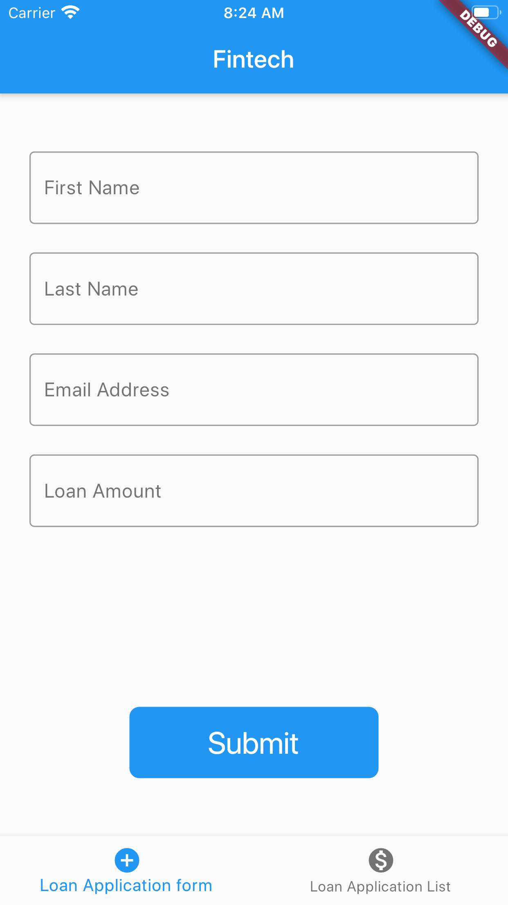

# Loan-Application

This application allows user to submit an application and see previous submitted loan application.

## Implementation Details:

Flutter(Google tool kit) has been used for building this application.
This application show two screens which is:
1. Screen for new loan application.
    * Application is validated before submitting as per the requirement.
    * Loading indicator is shown while waiting for data to load.
    * Error is shown in an alert if any error occurs during the process. 
    
2. Screen for viewing previously submitted applications.
    * Displays a list of applications in listview.
    * Loading indicator is shown while waiting for data to load.
    * Error message is shown if any error occurs during the process.

### Model used for showing detailed view

Below mentioned data has been used.
- MVC(Model view controller) design pattern is used in this application.
```
String firstName;
String lastName;
String email;
double loanAmount
```
- Unit test cases added for validator file.
### Screenshots:



